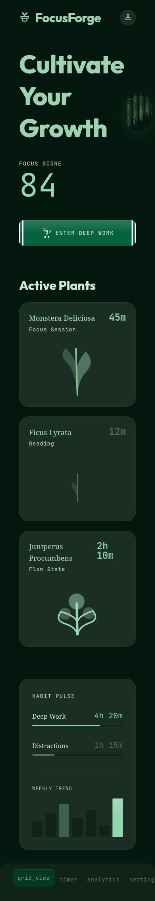
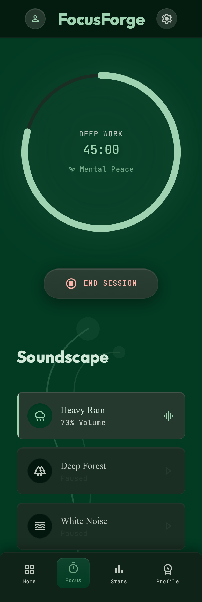
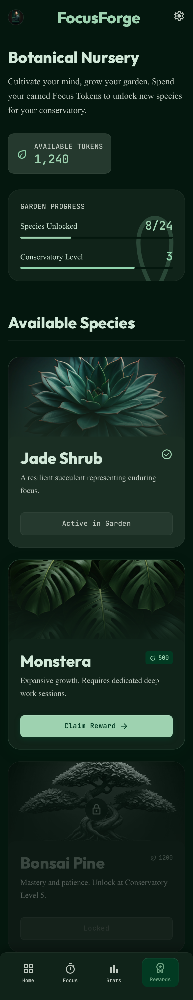
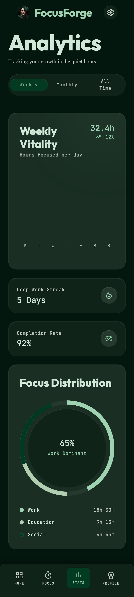
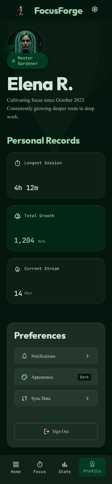

# 🌿 FocusForge: Botanical Sanctuary

**Forge your focus. Grow your digital garden. Own your time.**

FocusForge is a high-fidelity digital wellness application designed to help users reclaim their concentration through an immersive "Botanical Sanctuary" experience. Built for the **8x Contest**, it transforms the abstract concept of focus into a tangible, growing nursery of digital life.

---

## 🎭 The Aesthetic: Botanical Sanctuary
FocusForge is a sanctuary of "Mental Peace & Plants." The interface uses an **Off-Road Green** base to create a deep, grounded atmosphere reminiscent of a moonlit botanical garden. The design is high-variance and asymmetric, utilizing **Celadon White** as a singular, high-contrast accent. Interaction is fluid and cinematic, driven by heavy spring physics that make the UI feel tactile and alive.

## 📸 App Showcase

| Focus Dashboard | Deep Focus Timer |
|:---:|:---:|
|  |  |

| Botanical Nursery | Usage Analytics |
|:---:|:---:|
|  |  |

| Gardener Profile |
|:---:|
|  |

---

## 🚀 Key Features

### ⏱️ Deep Focus Engine
*   **Radial Timer**: A cinematic countdown with SVG progress rings and a trailing glow effect.
*   **Timestamp-Anchored**: Unlike typical `setInterval` timers, our engine uses a server-authoritative timestamp approach to remain 100% accurate even if the app is backgrounded.
*   **Soundscapes**: Immersive audio environments (Rain, Forest, Waves) to deepen concentration.

### 🪴 The Digital Nursery (Gamification)
*   **Botanical Rewards**: Every focus session earns "Growth Points" used to unlock and cultivate rare plants.
*   **Active Plants**: Your dashboard shows your currently growing flora, reflecting your real-world productivity.
*   **Mastery Ranks**: Progress from a "Seedling" to a "Master Gardener" based on your consistency and focus streaks.

### 📊 Vitality Analytics
*   **Weekly Vitality Chart**: A high-variance bar chart tracking your daily focus hours.
*   **Focus Distribution**: Overlapping SVG rings that visualize how you divide your time between Work, Education, and Leisure.
*   **Habit Pulse**: Real-time feedback on your deep work vs. distraction ratios.

### 🧠 Claude AI Coach
*   **Behavioral Coaching**: A built-in AI mentor with access to your focus patterns.
*   **Context-Aware**: Claude analyzes your digital nursery progress and suggests optimal session durations or ways to reduce screen time.

---

## ⚙️ Tech Stack
*   **Framework**: Expo (React Native) ~55.0
*   **Language**: TypeScript ~5.9
*   **Styling**: NativeWind (Tailwind CSS v4 engine)
*   **Design System**: Custom "Botanical Sanctuary" driven by CSS Variables
*   **State Management**: TanStack Query + React Context
*   **Database**: Supabase (Auth + PostgreSQL)
*   **Animations**: React Native Reanimated 4
*   **Icons**: Lucide React Native

---

## 🏗️ Technical Architecture

### 🛡️ Professional Hygiene
*   **Clean Repository**: All secrets and local configurations are strictly excluded via `.gitignore`.
*   **Type Safety**: 100% project-wide type checking success (`npm run typecheck` passes with 0 errors).
*   **Modular Components**: High-fidelity Stitch designs were surgically refactored into a modular, maintainable React Native component library.

### 🌓 Dynamic Theme Engine
FocusForge features a custom CSS-variable-based theme engine. The entire "Botanical Sanctuary" palette can invert between **Light Mode** (Celadon White default) and **Dark Mode** (Deep Forest) instantly without any layout shifts or "flickering."

---

## 🛠️ Setup & Development

### 1. Prerequisites
*   Node.js (v20 LTS recommended)
*   Expo CLI (`npm install -g eas-cli`)
*   Supabase CLI (for local development)

### 2. Installation
```bash
git clone https://github.com/kirixber/focusforge.git
cd focusforge
npm install
```

### 3. Environment Configuration
Copy the template and add your own credentials (see `.env.example` for required keys):
```bash
cp .env.example .env
```

### 4. Launching the App
```bash
npx expo start
```

---

## 📜 Reflection
For a detailed breakdown of the technical challenges overcome (including video splash scaling and theme inversion), please see [REFLECTION.md](./REFLECTION.md).

---

## 📂 AI Conversation Logs
The full history of the AI-driven development process, including the high-fidelity UI implementation with Stitch, is available in the [/ai-logs/](./ai-logs/) directory.
